# ⛽ Fuel-X — Smart Fuel Management & Distribution System

Fuel-X is a multi-portal fuel management platform that connects **vehicle owners**, **station employees**, **station owners**, and **corporate fuel suppliers (BPC Logistics)** in a single real-time ecosystem. It streamlines fuel discovery, queue management, emergency prioritization, inventory tracking, and supply-chain refilling — all from one unified system.

---

## 🌐 Overview

Fuel-X is built around **four distinct access portals**, each tailored to a specific role in the fuel supply chain:

| Portal | Role | Purpose |
|---|---|---|
| 🚗 **User Portal** | Vehicle Owner | Register, locate nearby stations, generate fuel tokens |
| 👷 **Employee Portal** | Station Staff | Verify identity, monitor live queue, serve tokens |
| 🏢 **Station Portal** | Station Owner | Manage inventory, request refills, monitor traffic |
| 🏭 **BPC Logistics Portal** | Corporate Supplier | Track reserves, approve refills, fulfill station orders |

---

## ✨ Key Features

### 🔐 Secure Authentication & Onboarding
- Phone/password-based login with role-based access (User / Employee / Station / BPC)
- Multi-channel identity verification via **Telegram** or **Email OTP**
- Automatic location detection upon successful verification

### 📍 Smart Terminal Finder
- Detects the user's live location and lists fuel stations within a 20 KM radius
- Displays real-time **traffic congestion status** (Smooth / Busy / Heavy) per station
- Shows live fuel prices (Octane, Diesel, Petrol) and direct Google Maps navigation

### 🚘 Digital Vehicle Entry & Token Generation
- Contactless vehicle entry using digital plate number verification
- Vehicle classification (Regular / Ambulance–Emergency, etc.) with quota-based allocation
- Instant **fuel token generation** with fuel type and quantity selection

### 🚨 Emergency Priority Queue
- Automatic **priority flagging** for emergency vehicles (e.g., ambulances)
- Instant access tokens bypass the standard queue with a dedicated priority banner
- Option to proceed to the live queue list or file a service complaint

### 👷 Employee Operations Console
- Employee ID–based authentication with shift and designation details
- **Live Station Queue Control** dashboard showing token IDs, vehicle numbers, and slot status
- Real-time fuel rate display alongside the active queue

### 🏢 Station Owner Dashboard
- Facility-level view of vehicles in queue and live operational status
- Request specific fuel refill volumes per variant directly to the supplier
- **Live on-site inventory monitoring** with safety threshold alerts and last-scan timestamps

### 🏭 BPC Logistics (Corporate Supply Hub)
- Centralized command center for tracking **gross reserves** across all stations
- **Automated low-fuel network alerts** flagging stations below critical thresholds
- One-click refill dispatch and fulfillment of owner-submitted custom liter requests

---

## 🖼️ Screenshots

### User Flow

**1. Login**
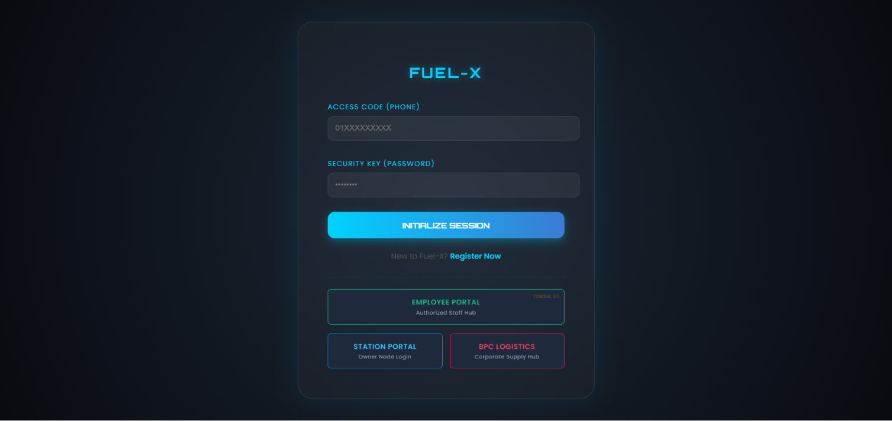

**2. Registration**
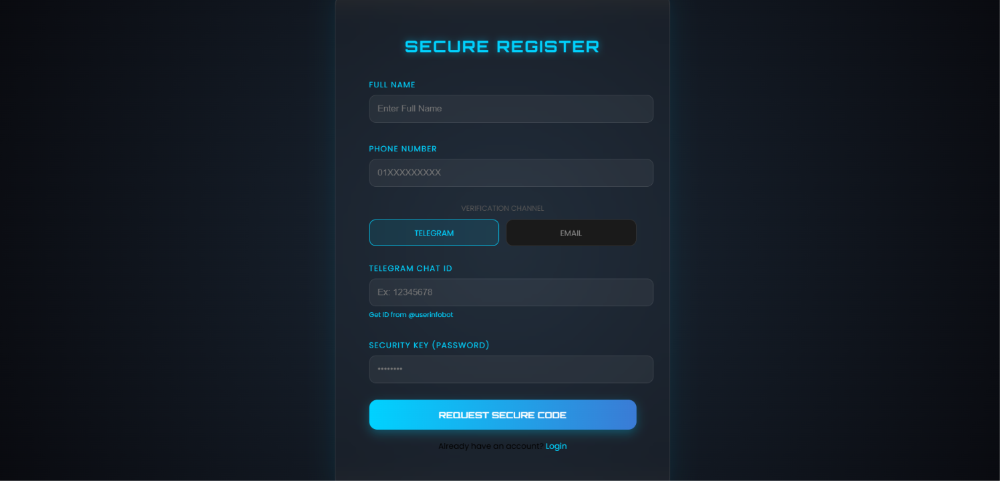

**3. OTP Verification**
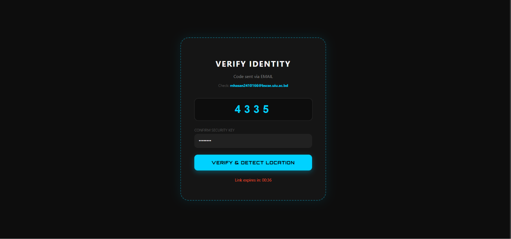

**4. Smart Terminal Finder**
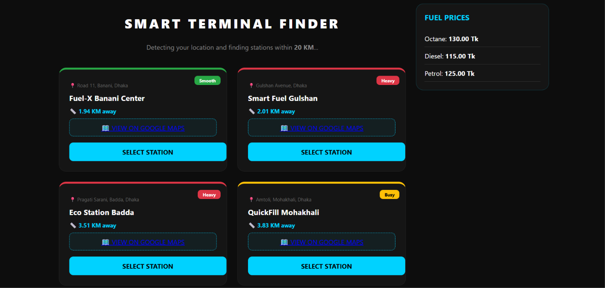

**5. Vehicle Entry**
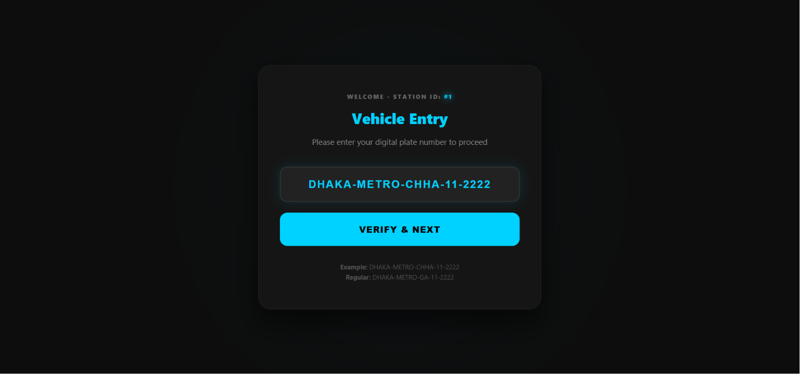

**6. Fuel Terminal**
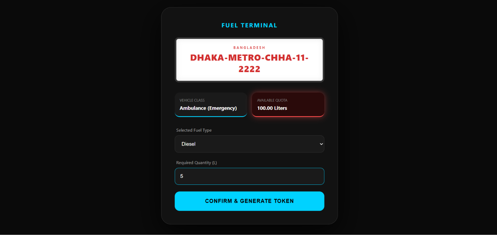

**7. Fuel Token Generated**
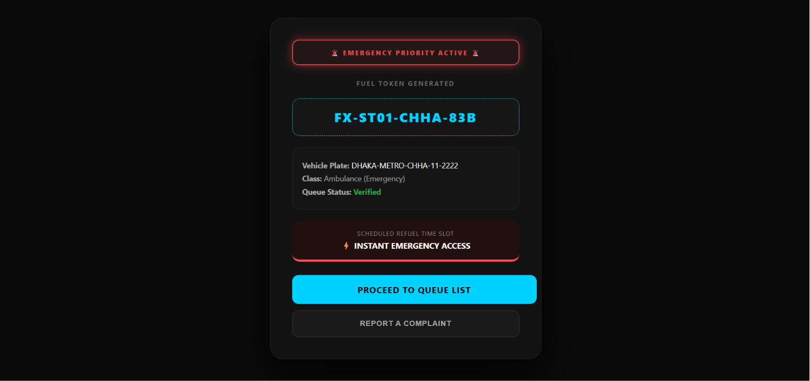

### Employee Flow

**8. Employee Login**
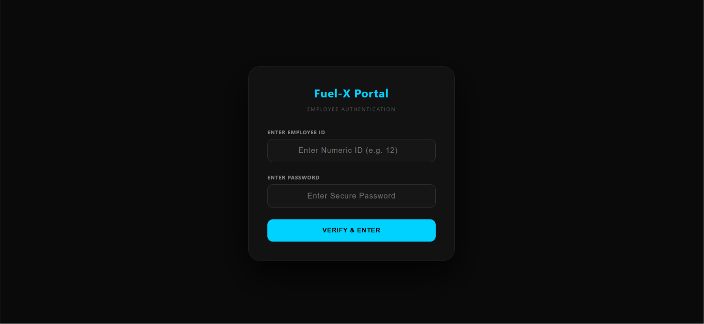

**9. Identity Verified**
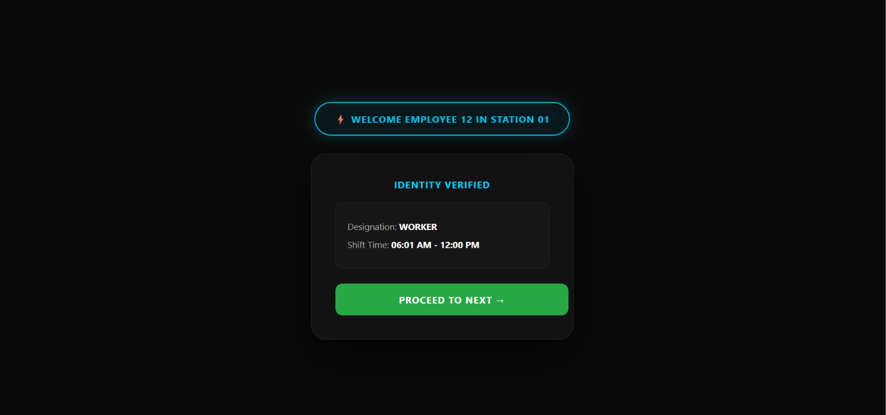

**10. Live Station Queue Control**
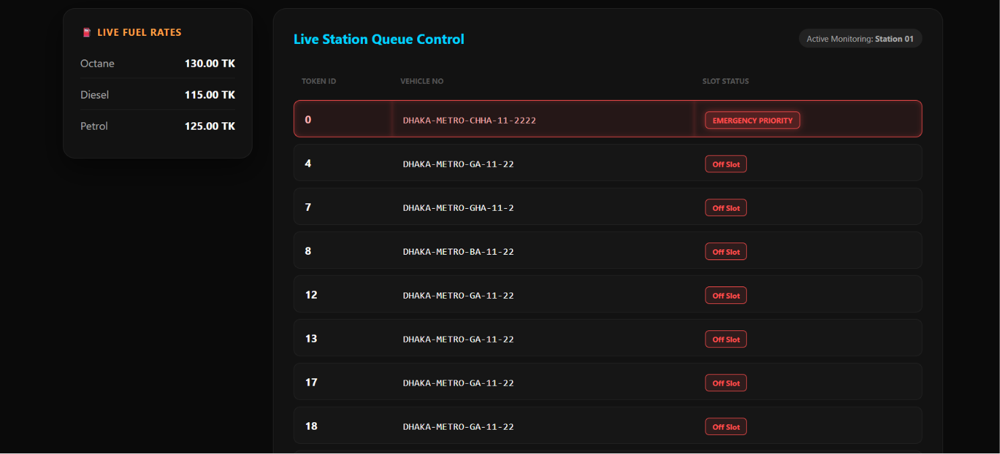

### Station Owner Flow

**11. Station Login**
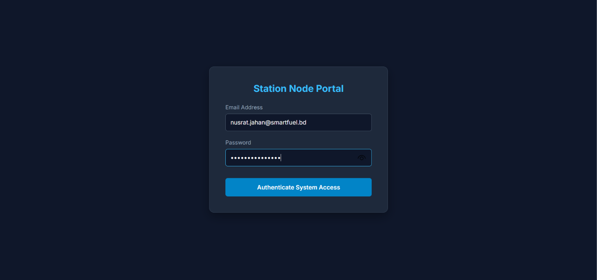

**12. Station Dashboard**
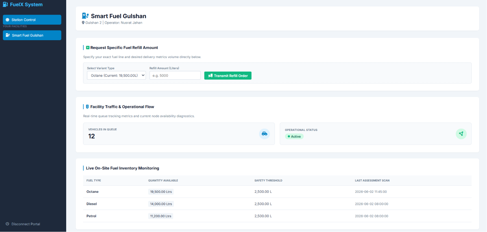

### BPC Logistics Flow

**13. BPC Login**
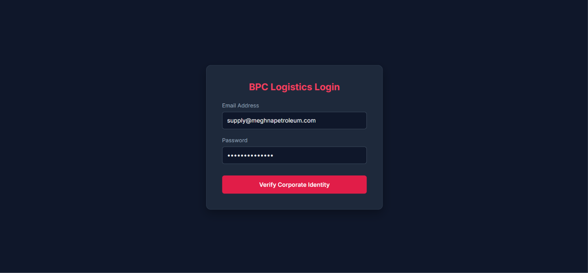

**14. BPC HQ Dashboard**
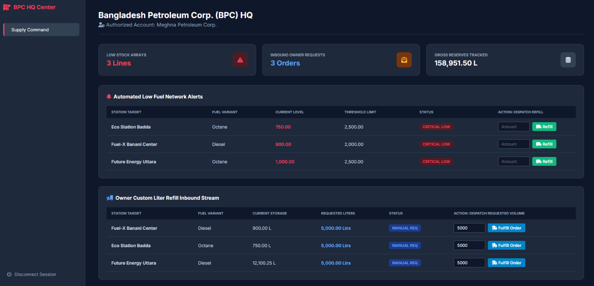

---

## 🏗️ System Architecture

```
                ┌─────────────────────┐
                │      User App        │
                │ (Registration/Token)  │
                └──────────┬───────────┘
                           │
                ┌──────────▼───────────┐
                │   Employee Console    │
                │  (Queue Verification) │
                └──────────┬───────────┘
                           │
                ┌──────────▼───────────┐
                │   Station Dashboard   │
                │ (Inventory & Refill)  │
                └──────────┬───────────┘
                           │
                ┌──────────▼───────────┐
                │  BPC Logistics HQ     │
                │ (Supply & Fulfillment)│
                └───────────────────────┘
```

---

## 🛠️ Tech Stack

> ℹ️ Update this section with your actual stack — the placeholders below reflect a typical setup for this type of project.

- **Frontend:** HTML5, CSS3, JavaScript
- **Backend:** Node.js
- **Database:** MongoDB / MySQL *(specify your choice)*
- **Notifications:** Telegram Bot API, Email (SMTP)
- **Maps & Geolocation:** Google Maps API

---

## 🚀 Getting Started

### Prerequisites
- Node.js (v16+)
- npm or yarn
- A configured database instance

### Installation
```bash
# Clone the repository
git clone https://github.com/<your-username>/fuel-x.git
cd fuel-x

# Install dependencies
npm install

# Configure environment variables
cp .env.example .env

# Start the application
npm start
```

### Environment Variables
```env
PORT=8080
DATABASE_URL=your_database_connection_string
TELEGRAM_BOT_TOKEN=your_telegram_bot_token
SMTP_HOST=your_smtp_host
SMTP_USER=your_smtp_user
SMTP_PASS=your_smtp_password
GOOGLE_MAPS_API_KEY=your_google_maps_api_key
```

---

## 📋 Roadmap
- [ ] SMS-based OTP as an alternative verification channel
- [ ] Analytics dashboard for fuel consumption trends
- [ ] Mobile app (Android/iOS) companion
- [ ] Payment gateway integration for prepaid fuel tokens

---

## 🤝 Contributing
Contributions, issues, and feature requests are welcome. Feel free to check the [issues page](../../issues) or open a pull request.

---

## 📄 License
This project is licensed under the MIT License — see the [LICENSE](LICENSE) file for details.

---

## 👤 Author
**Sajid**
CSE Student, UIU

---

<p align="center">Built with ⚡ to make fuel distribution smarter, faster, and safer.</p>
